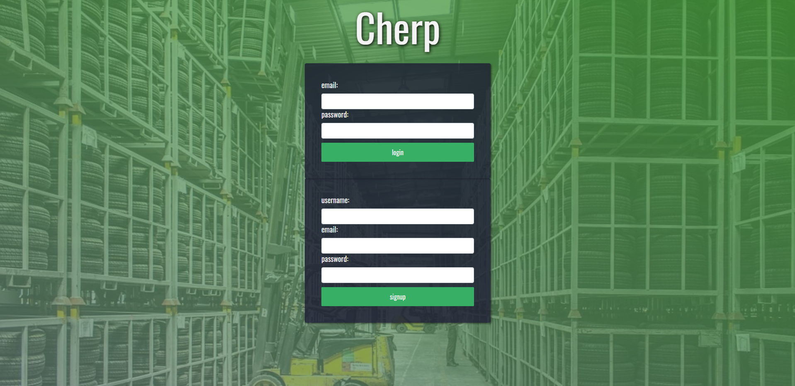
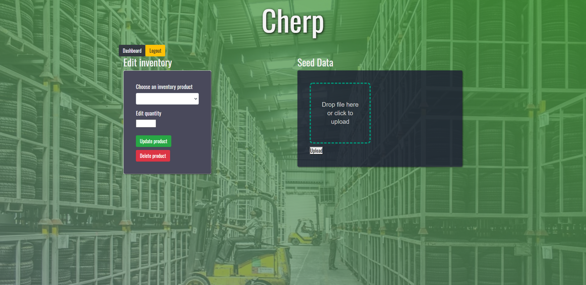
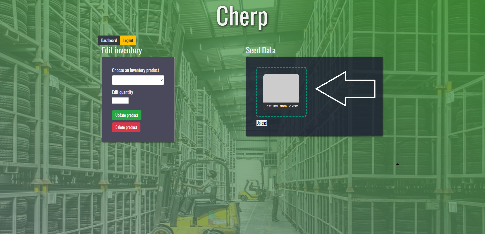
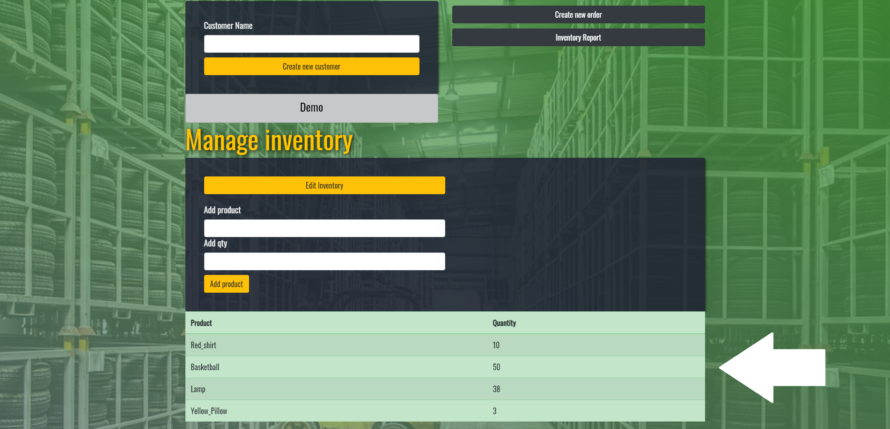
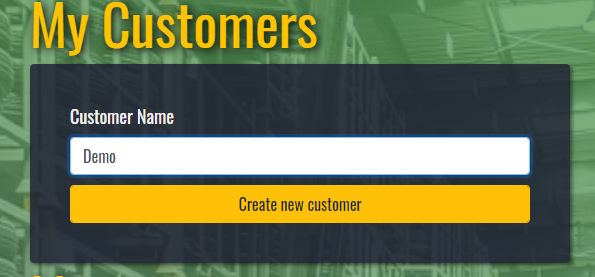
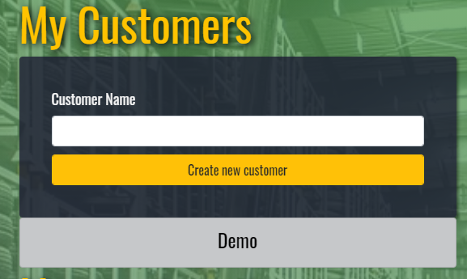

# _Cherp_
_For owners of a small business who feel “too large” for excel and “too small” for out of the box erp solutions-- we bring you Cherp. The easy to use inventory & order management system that will allow you to focus on your business, and we’ll remember all of the details for you-- large or small._
> Live demo [_here_](https://cherp-io.herokuapp.com/). 

## Table of Contents
* [Technologies Used](#technologies-used)
* [NPM modules Used](#node-modules-used)
* [Features](#features)
* [Project Status](#project-status)
* [Room for Improvement](#room-for-improvement)

## Technologies Used
- Tech 1 - **JavaScript**
- Tech 2 - **Node.js**
- Tech 3 - **MySQL**
- Tech 4 - **CSS**
- Tech 5 - **HTML5**
- Tech 6 - **Heroku**

## Node Modules Used: 
- **mysql2**
- **sequelize**
- **connect-session-sequelize**
- **express**
- **express-handlebars**
- **express-session**
- **express-fileupload**
- **xlsx**
- **bcrypt**
- **dotenv**

## Features
Ready Features:
1. **Allows the user to signup and login with the account created**

2. **Allows the user to add products**
3. **Allow the user to delete a product**
4. **Allow the user to edit the quantity of the product**
5. **Allows the user to drag or upload an excel sheet that will automatically upload all the products and quantity into the inventory**

6. **Allows the user to view the current inventory**

7. **Allows the user to create a new customer**

8. **Allows the user to view current customers**
9. **Allows the user to view all the orders of each customer and the due date of them**
10. **Allows the user to create new orders for customers**
11. **Allows the user to delete orders**

9. **Allows the user to generate a report of the current products and quantity and the demand for each product**

## Project Status
Project is: _in progress_

## Room for Improvement
Room for improvement:
- TBD

To do:
- A report function that tells users **when** re-orders are necessary.
- The ability to **search** for all relevant data points from the dashboard.
- The ability to **edit** order details.
- The ability to intelligently **seed** user inventory where duplicates exist.
- The ability to **seed** orders & order details.
- Styling overhaul.
